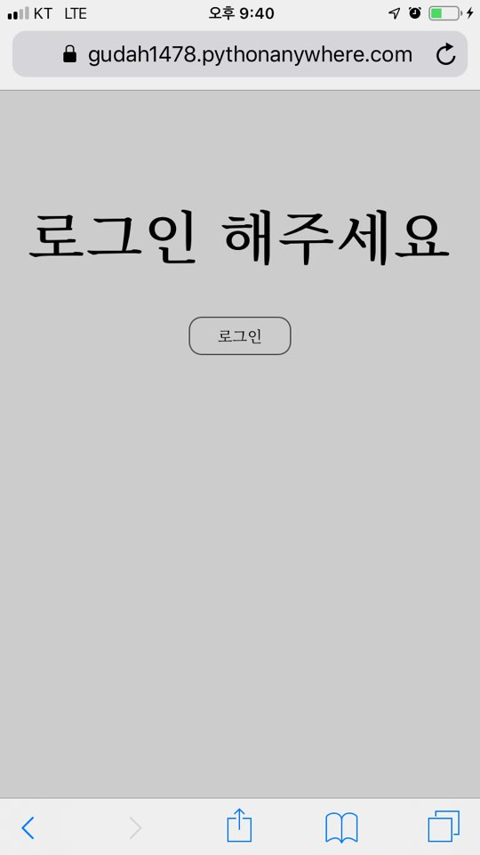

Secretary_mo
함께 살고있는 룸메이트들과 같이 사용하기 위해 웹 사이트를 제작했습니다.

1. 나의 방 모니터링 기능

Arduino UNO, DHT11, ESP8266을 이용해 주기적으로 웹 사이트에 센싱 데이터들을 POST 합니다.

웹 사이트 측에서 GET한 데이터들을 sqlite에 수집하고 가장 최신의 데이터들을 보여줍니다.

(추후 모션 센서를 추가해 방 안의 움직임을 탐지하는 기능을 추가할 예정이며 LPWAN 환경에 적용하고자
Wi-Fi가 아닌 Cat.M1 통신으로 데이터를 전송할 예정입니다.)

2. 메모 기능

간단한 메모를 기록하는 기능입니다.

계정별로 관리가 가능하고 작성한 일시, 날씨, 위치를 알 수 있습니다.

Javascript의 geolocation 함수를 이용해 메모를 등록한 위치를 파악합니다.

KAKAO REST API를 이용해 현 위치의 한글 주소명을 기록합니다.

Openwheather API를 이용해 현 위치의 날씨, 온도, 습도를 기록합니다.

3. 가계부 기능

이전까지는 구글 스프레드시트에 가계부를 제작해 사용하였습니다.

그러나, 저희의 용도에 최적화하는데 제약이 있었고 사용 과정이 번거로웠습니다.

이러한 문제를 해결하고자 가계부 기능을 자체적으로 개발했습니다.

첫 화면은 현재 남아있는 잔고를 확인하는 화면입니다.

그리고 가계부를 추가할 경우, 로그인한 계정을 인식해서 작성자는 자동으로 입력하도록 하고

입금할 경우에만 잔고에 금액을 추가하고 그 외는 잔고에 금액을 뺍니다.
